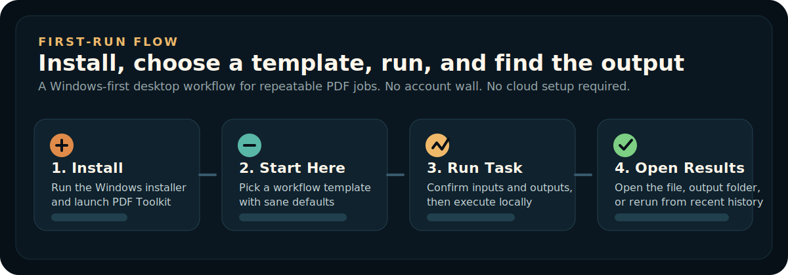
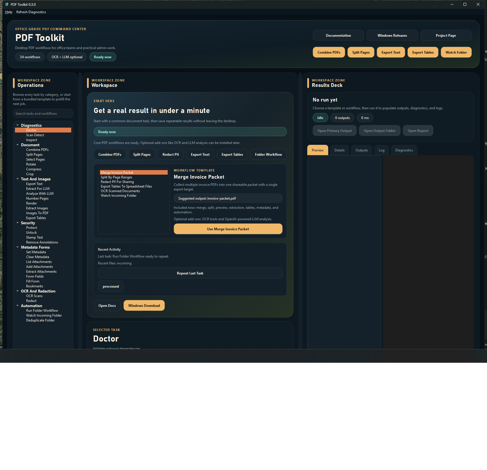

# PDF Toolkit

<p align="center">
  
</p>

<p align="center">
  Installable, offline-first PDF workflows for office teams, admin work, and repeatable Windows desktop document cleanup.
</p>

<p align="center">
  <a href="https://github.com/AboveWireless/WirelessOffice/releases">Download for Windows</a> |
  <a href="docs/run-from-source.md">Run from source</a> |
  <a href="docs/enabling-ocr.md">Enable OCR later</a> |
  <a href="docs/enabling-llm.md">Enable OpenAI analysis</a>
</p>

## Why this exists

PDF Toolkit is built for the jobs people actually repeat all week, not for demo PDFs:

- combine invoice packets
- split filing sets by page range
- redact PII before sharing
- export text and tables for downstream systems
- produce LLM-ready document bundles for downstream prompts and indexing
- run repeatable folder workflows locally on Windows

It is Windows-first, offline-first, and designed to feel like a normal desktop app instead of a Python setup project.

## 30-second tour



## Best for

| Team or task | Why PDF Toolkit fits |
| --- | --- |
| Office admins | Fast merge, split, export, preview, and cleanup without bouncing between utilities |
| Operations teams | Repeatable folder workflows, consistent output paths, and local batch processing |
| Compliance work | Redaction, extraction, diagnostics, and clear output/report locations |
| Power users | Deep PDF operations without giving up a simple install and first-run flow |

## 2-minute start

1. Open the latest [GitHub Release](https://github.com/AboveWireless/WirelessOffice/releases).
2. Download `pdf-toolkit-setup-windows-x64.exe`.
3. Run the installer and accept the default per-user install path.
4. Launch `PDF Toolkit` from Start Menu.
5. Use `Start Here`, pick a workflow template, and run the job.

If you prefer a portable copy, download `pdf-toolkit-windows-x64.zip` instead.

## Start Here and workflow templates

The app opens to a `Start Here` surface that gets a new user to a real result fast:



- quick routes for combine, split, redact, export text, export tables, and folder workflows
- bundled workflow templates with sane defaults for common office tasks
- readiness messaging that separates core-ready from optional add-ons
- recent files, recent output folders, and `Repeat Last Task`

Built-in templates currently include:

- Merge Invoice Packet
- Split By Page Ranges
- Redact PII For Sharing
- Export Tables To Spreadsheet Files
- OCR Scanned Documents
- Watch Incoming Folder

## What works immediately

- Merge, split, rotate, crop, render, and page numbering
- Preview and inspect PDF contents before exporting
- Text extraction, image extraction, attachments, forms, bookmarks, and metadata tools
- Table export to CSV, XLSX, and JSON
- LLM-ready extraction bundles in Markdown, JSON, and JSONL for downstream processing
- Batch jobs, watch folders, and duplicate-file cleanup

## Optional add-ons and advanced workflows

- OCR for scanned PDFs remains optional
- OpenAI-powered LLM analysis remains optional
- LLM-ready extraction is built in, so you can prepare chunked document bundles even on offline machines
- Folder workflows can combine core steps with LLM extraction when you need structured downstream artifacts

## Why this instead of random PDF tools?

- It is installable like a normal Windows program, but still open-source and portable.
- It keeps repeatable workflows local instead of pushing users toward cloud accounts.
- It treats output folders, reports, and reruns as first-class parts of the UX.
- It makes optional features like OCR and LLM analysis visible without making the core app feel broken.

## OCR note

OCR is intentionally optional in the first public release.

Core PDF workflows work out of the box. If you want OCR, install or bundle:

- `ocrmypdf`
- `tesseract`
- Ghostscript (`gswin64c.exe`)

Details: [docs/enabling-ocr.md](docs/enabling-ocr.md)

## OpenAI analysis note

OpenAI-powered LLM analysis is optional.

- packaged Windows builds can expose it when `OPENAI_API_KEY` is set
- source installs should add the `llm` extras
- local LLM-ready extraction works without network access

Details: [docs/enabling-llm.md](docs/enabling-llm.md)

## Sample workflows

- Merge monthly invoice PDFs with `Merge Invoice Packet`
- Split filing packets with `Split By Page Ranges`
- Redact PII for outside sharing with `Redact PII For Sharing`
- Export tables for spreadsheets with `Export Tables To Spreadsheet Files`
- Export LLM-ready Markdown/JSON/JSONL bundles for downstream prompts and indexing
- Set up recurring intake processing with `Watch Incoming Folder`

More examples: [docs/sample-workflows.md](docs/sample-workflows.md)

## Install options

### Recommended: Windows installer

Follow [docs/install-windows.md](docs/install-windows.md).

### Portable ZIP fallback

Download `pdf-toolkit-windows-x64.zip`, extract it to a normal folder, and run `pdf-toolkit-gui.exe`.

### Source install

```powershell
python -m venv .venv
.\.venv\Scripts\Activate.ps1
python -m pip install -U pip
python -m pip install -e .[dev]
python -m pdf_toolkit
```

If you also want optional OpenAI analysis from source:

```powershell
python -m pip install -e .[llm]
```

You can also use:

```powershell
.\run_pdf_toolkit.bat
```

## Build the packaged app

```powershell
powershell -ExecutionPolicy Bypass -File scripts\build_gui.ps1
```

To produce release artifacts locally:

```powershell
powershell -ExecutionPolicy Bypass -File scripts\package_release.ps1
```

To build only the Windows installer from an existing packaged app:

```powershell
powershell -ExecutionPolicy Bypass -File scripts\build_installer.ps1
```

## Support stance

- Windows is the supported platform for the first public release.
- The Windows installer is the recommended install path.
- The portable ZIP remains available as a fallback/manual option.
- The app is offline-first and does not include auto-update behavior in this release.
- OCR is optional and may require extra local tools.
- LLM features remain secondary and optional, not the main product story.
- LLM-ready extraction is included; OpenAI analysis is optional.
- Source install remains available for developers and advanced users.

## Troubleshooting

- Packaged app will not start: [docs/troubleshooting.md](docs/troubleshooting.md)
- Installer shows a SmartScreen warning: expected for this unsigned first release
- OCR shows as missing: expected unless OCR tools were installed separately
- LLM analysis shows as unavailable: expected unless `OPENAI_API_KEY` is configured
- Source install problems: recreate `.venv` and reinstall with Python 3.11+

## Contributing

See [CONTRIBUTING.md](CONTRIBUTING.md).

## License

MIT. See [LICENSE](LICENSE).
